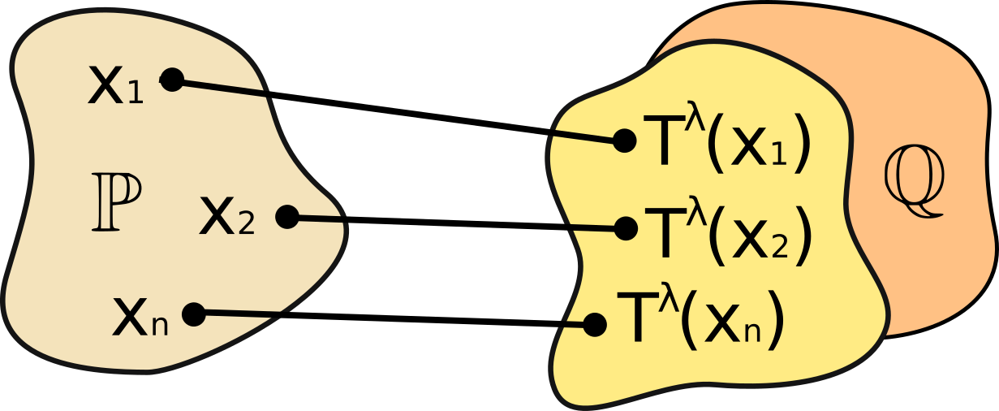
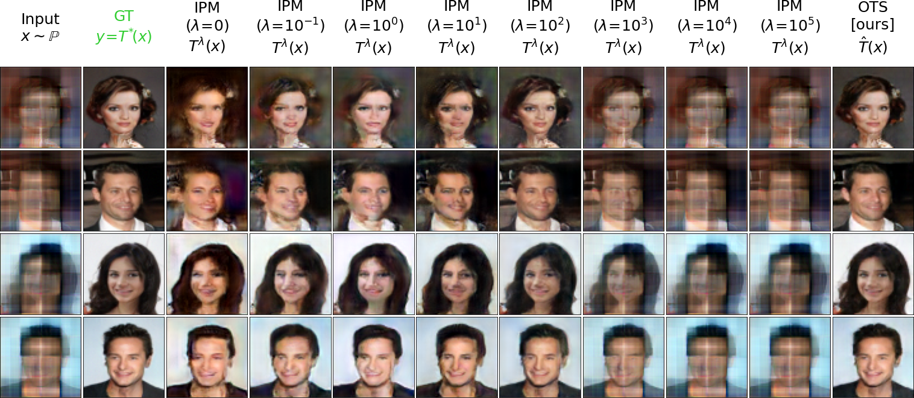

# An Optimal Transport Perspective on Unpaired Image Super-Resolution
This is the official `Python` implementation of the [JOTA](https://link.springer.com/journal/10957) paper **An Optimal Transport Perspective on Unpaired Image Super-Resolution** by [Milena Gazdieva](https://scholar.google.com/citations?user=h52_Zx8AAAAJ&hl=en), [Petr Mokrov](https://scholar.google.com/citations?user=CRsi4IkAAAAJ&hl=en&oi=ao), [Litu Rout](https://scholar.google.com/citations?user=GYy7fWwAAAAJ&hl=en&oi=ao), [Alexander Korotin](https://scholar.google.ru/citations?user=1rIIvjAAAAAJ&hl=en), [Andrey
Kravchenko](https://www.hertford.ox.ac.uk/staff/andrey-kravchenko), [Alexander Filippov](https://scholar.google.com/citations?hl=en&user=fY5epnkAAAAJ), [Evgeny Burnaev](https://scholar.google.com/citations?hl=en&user=pCRdcOwAAAAJ).

Our paper performs a **theoretical analysis** of the adversarial methods - Generative Adversarial Networks (GANs), Neural Optimal Transport (OTS) solver, which are typically used when solving different unpaired domain translation problems, e.g., **image super-resolution** (SR) one. 

The repository contains reproducible `PyTorch` source code for performing comparison of OTS [solver](https://github.com/iamalexkorotin/NeuralOptimalTransport/) which allows calculating **optimal transport** (OT) **maps** in high dimensions with neural networks and selected GANs. Examples are given for [Wasserstein-2 benchmark](https://github.com/iamalexkorotin/Wasserstein2Benchmark) dataset and for the large-scale unpaired image-to-image translation task. The experiments support our theoretical conclusion that:
>"Oppositely to neural OT methods GANs’ maps are biased, i.e., they do not transform the low-resolution (LR) image distribution to the true high-resolution (HR) image distribution."

<p align="center"></p>

## Related repositories
- [Repository](https://github.com/iamalexkorotin/NeuralOptimalTransport) for [Neural Optimal Transport](https://arxiv.org/abs/2201.12220) paper (ICLR 2023).
- [Repository](https://github.com/iamalexkorotin/Wasserstein2Benchmark) for [Wasserstein-2 benchmark](https://arxiv.org/abs/2106.01954) paper (NeurIPS 2021).

## Experiment with Wasserstein-2 Benchmark

We note that IPM GANs regularized with content losses and Neural OT solver employ very **similar saddle-point optimization objectives** which differ by the `sup`-`inf` order and constraints on the admissible potentials (discriminators). We show theoretically that the solutions of regularized GANs are *biased* (Theorem 4.1, Corollary 4.1), i.e., do not necessarily transform distribution of LR images to HR ones and illustrate the bias issue experimentally. 

In this experiment, we empirically confirm the insight that the solution $T^{\lambda}$ of regularized GAN's objective may not satisfy $T^{\lambda}\sharp\mathbb{P}=\mathbb{Q}$. Notably, if $T^{\lambda}\sharp\mathbb{P}=\mathbb{Q}$, then from our Lemma 4.1 it follows that $T^{\lambda}$ coincides with an OT map from $\mathbb{P}$ to $\mathbb{Q}$ for $c(x,y)$. Thus, to assess the bias, we compare the learned map $T^{\lambda}$ with the ground truth OT map $T^{*}$ for $\mathbb{P}$, $\mathbb{Q}.$

For evaluation, we use the [Wasserstein-2 benchmark](https://github.com/iamalexkorotin/Wasserstein2Benchmark). It provides high-dimensional continuous pairs $\mathbb{P}$, $\mathbb{Q}$ with an *analytically known* OT map $T^{*}$ for the quadratic cost ${c(x,y)=\|x-y\|^{2}}$. We use their "Early" images benchmark pair. 

<p align="center"></p>

The performance of the regularized IPM GAN *significantly* depends on the choice of the content loss value $\lambda$. Still, even for the best performing $\lambda=10^{2}$ **all metrics are notably worse than for OTS**. Importantly, OTS decreases the burden of parameter searching as there is no parameter $\lambda$. 

## Repository structure
The implementation is GPU-based with the multi-GPU support. Tested with `torch==1.7.1` and 1 Tesla V100.

All files related to benchmark experiment are located in `benchmark/` subfolder. Benchmark experiments are issued in the form of pretty self-explanatory jupyter notebooks (`benchmark/notebooks/`):
- ```IPM_test_images_benchmark.ipynb``` - benchmark experiment with IPM GAN;
- ```OTS_test_images_benchmark.ipynb``` - benchmark experiment with OTS solver;
- ```OTS_vs_IPM_plots.ipynb``` - testing and plotting the results of comparison for IPM GAN and OTS solver.
Checkpoints for the models trained for the benchmark experiment are located in `benchmark/checkpoints/` subfolder. To run the experiments, ***1) download the code for Wasserstein-2 benchmark from the official [GitHub repository](https://github.com/iamalexkorotin/Wasserstein2Benchmark), and 2) locate the ```benchmark/``` subfolder in its root.*** 

Other code is structured as follows: 
- ```aim19_unpaired_sr.py``` - large-scale experiment with unpaired image SR;
- ```test.ipynb``` - testing and plotting the SR results ([pre-trained models](https://github.com/milenagazdieva/OT-Super-Resolution/state_dicts/) are needed);
- ```models/``` - subfolder with `.py` files for models architectures (UNet, EDSR).
Auxilary source code for is moved to `.py` modules in `utils/` and `dataset_utils` subfolders. Checkpoints for large-scale evaluation are located in `state_dicts/` folder.

For **training on AIM19 dataset**, run:

```python aim19_unpaired_sr.py --steps 100000 --G_arch EDSR --cost MSE --G_iters 15 --D_iters 25000 --bs 8 --plot 2000 --fid 2000```


## Datasets
- [AIM19 dataset](https://competitions.codalab.org/competitions/20164) should be pre-processed with ```dataset_utils/aim19_prepare_data.py```;
- [Wasserstein-2 benchmark](https://github.com/iamalexkorotin/Wasserstein2Benchmark).

## Credits
- [Weights & Biases](https://wandb.ai) developer tools for machine learning;
- [pytorch-fid repo](https://github.com/mseitzer/pytorch-fid) to compute [FID](https://arxiv.org/abs/1706.08500) score;
- [UNet architecture](https://github.com/milesial/Pytorch-UNet) for transporter network;
- [ResNet architectures](https://github.com/harryliew/WGAN-QC) for generator and discriminator.
